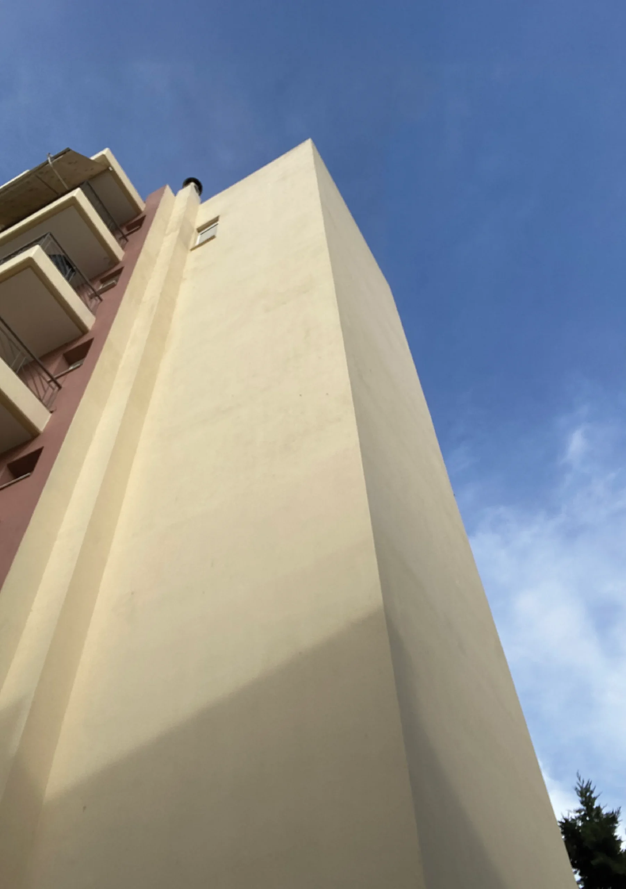
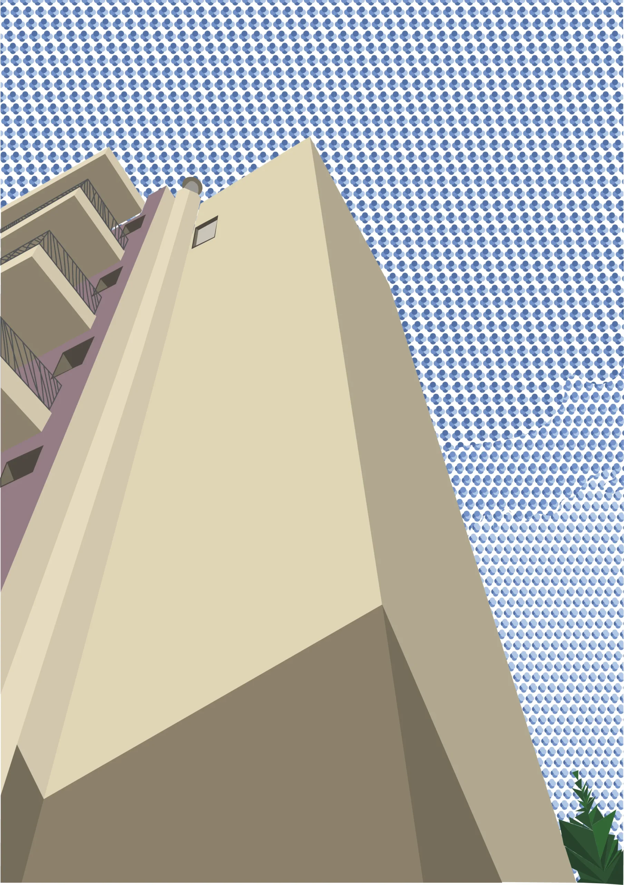

A five-storey apartment building, a typical example of the Greek urban landscape, stands proud due to its volume and angle of the shot, while people live in it every day and sometimes collide. Here, it is used as a vehicle for co-existing and conflicting thoughts, the security provided by a deterministic and structured environment and the insecurity and sense of the unknown caused by the artist’s need for creative expression. These conflicting thoughts can be dark and overwhelming for the individual, such as the volume of the building in this particular shot and the stark contrast of black and white chosen for the composition. However, it is believed that somewhere between the exploration of these dipoles lies the essence of creativity and by encouraging this search, i.e. watering it, the individual’s creativity can blossom.

Flowers are used as symbols of creative work. A porcelain teapot has been chosen as the watering can, which creates associations with the past and symbolizes the wisdom of the past and its acceptance. The hand holding the watering can is the hand of the creator herself, although this connection is not obvious to the casual observer. However, the aim was to imply that the creative person herself must find the courage to explore the complexity of these thoughts to lead to creative liberation.
The words have been collected by the essay of Debbie Millman “Fail Safe”, part of the anthology Look Both Ways: Illustrated Essays on the Intersection of Life and Design (2009).

