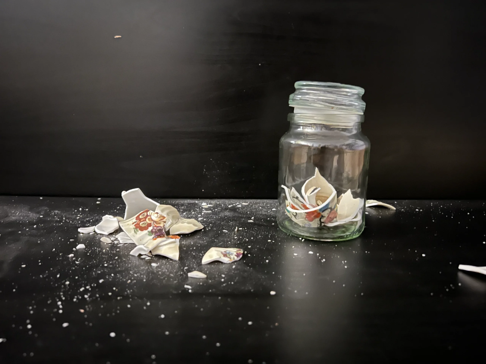
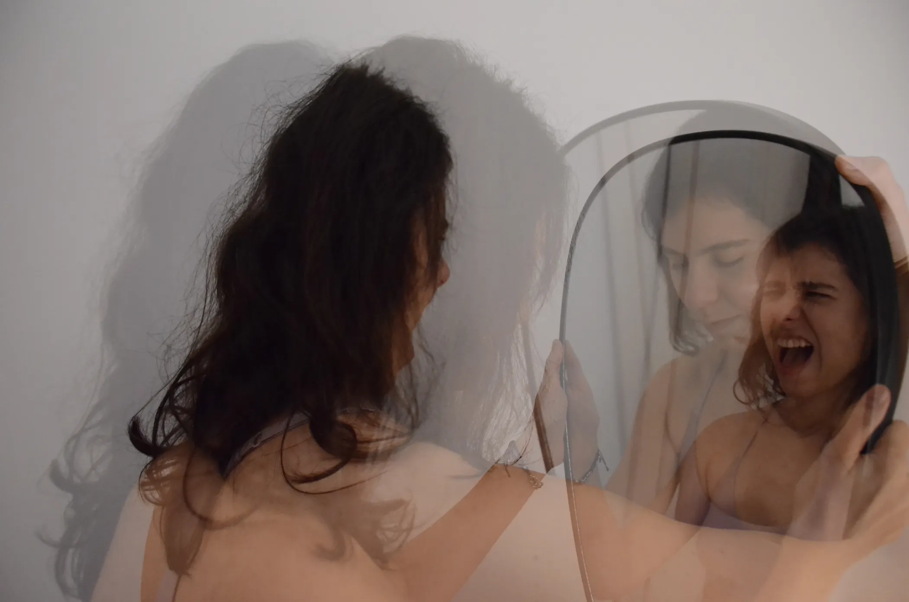
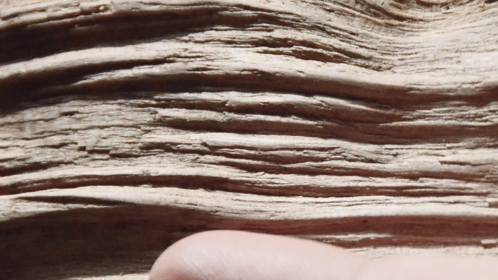
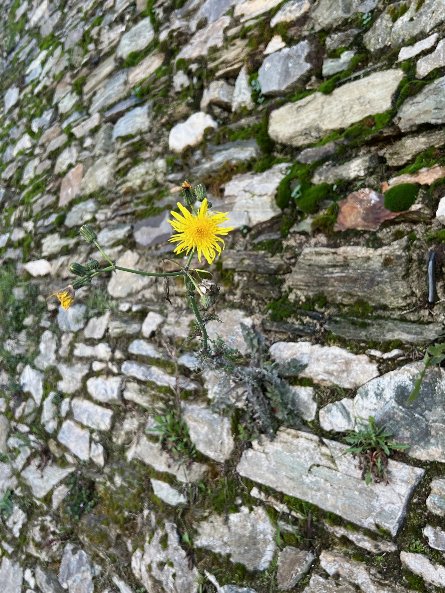

After numerous photo walks, it was concluded that inevitably some of the photos would have to be “staged” in the studio as they were hard to find in the environment. At this point, there was a conflict of the creator due to the nature of photography as a mimetic representation of the real (Tsatsoulis, 1997) and the creation of a constructed and therefore unrealistic reality. It should be noted that there is no illusion, or rather naivety, that the photographs, that flood every possible screen and every possible medium on a daily basis, are an accurate representation of reality. However, each creator has both its own values and the responsibility for its work. Therefore, in order for the photograph to be constructed but not lying, and to reconcile with the consciousness of the creator, it was chosen to explore the creator’s honest conflict with herself through a variety of perspectives.

## The past
The photograph of still life is about the past.
As the individual clashes with its past self and analyses and deconstructs it, breaking it into pieces, instead of rejecting those pieces that cause shame and anger, it selects and carefully preserves them, with acceptance and understanding, so that gradually can blossom as a wiser and more balanced person.
### Semiotics
From the study of the photographs relating to the collision, the signifiers, pieces of matter being thrown, dust and the stark contrast of the white porcelain against the black background have been used. Also, the porcelain acts as a symbol of the past due to its antiquity and its use as an heirloom and contrasts with the modern transparent vase. From the study of the photographs relating to symbiosis, signifiers, contact and metaphorically bare skin have been used. Contact, in the sense that the transparent vase embraces the porcelain pieces without constricting or crowding them, since they are positioned so that they bloom. Bare skin metaphorically, in the sense that the transparent vase leaves everything exposed visually and it has already been analyzed how the exposure relates to symbiosis.

## The present
The portrait photo is about the present.
In the photograph, the reflection in the mirror, the mirror-image, functions as an expression of the real emotions, which the real person tries to hide since they are not directly visible in the photograph. With the use of multiple exposure, comes the level of reconciliation and acceptance, the real and the reflection become symmetrical and “aligned”, the person leans towards the mirror and inwards while actively embracing the mirror.
### Semiotics
From the study of the conflict-related photographs, the signifiers, expression wrinkles/grimace, tension in the hand holding the mirror at a sharp angle and the portrait studied specifically in the case of the internal conflict have been used. From the study of the photographs concerning the symbiosis, the signifiers, contact, bare skin, and specifically from the internal symbiosis the signifiers double and portrait have been used.

## The future
The non-representational photograph is about the future.
The body, the skin collide with time and age. The most characteristic sign is the formation of wrinkles. This collision is so frightening because it acts as an indicator of the distance from death. In modern society, the collision with time is concealed in every possible way so symbiotic elements are hard to find. In my opinion, symbiosis is achieved by observing the changes that inevitably occur with tenderness towards the natural evolution of organisms through time.
### Semiotics
From the study of the photographs relating to the collision, the signifiers, expression wrinkles/grimace and lines/traces of movement have been used. In the absence of wrinkled skin, a piece of wood has been selected where the passage of time is clearly shown by the complexity of the grooves and marks. From the study of the symbiotic photographs, signifiers, contact and bare skin have been used. A finger, lacking the marks of time, gently touches the grooves as if trying to map them.

## Beauty
The urban landscape photograph is about beauty.
It is a flower growing in adverse conditions, in the cracks of a stone wall. It is a conflictual – symbiotic relationship. On the one hand, human intervention destroys the natural environment where the flower would thrive, on the other hand, the flower is nourished, and through this process, one could say, destroys part of the wall in order to exist. At the same time, the roots of the flower become a binder to reduce the erosion of the wall by air and water. As one’s relationship with oneself has been explored from a conflict and symbiotic perspective, this flower symbolizes that despite the difficulty involved in this relationship something very beautiful can emerge.
### Semiotics
From the study of the photographs relating to conflict, signifiers have been used, lines of movement from a sharp angle, the flower does not grow straight upwards but at an angle in relation to the wall. From the study of the photographs concerning symbiosis, the signifiers, contact, it is rooted to the wall and pair-dipole, natural-manufactured environment have been used.

