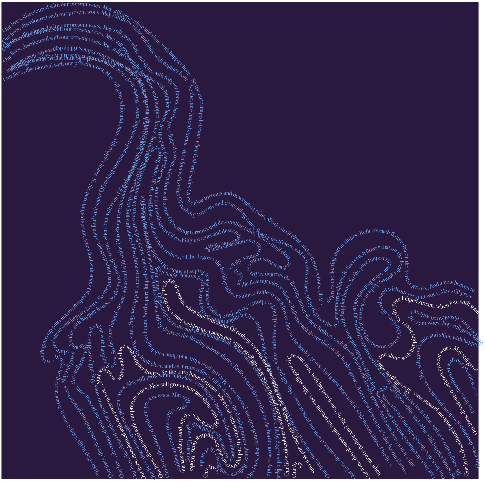
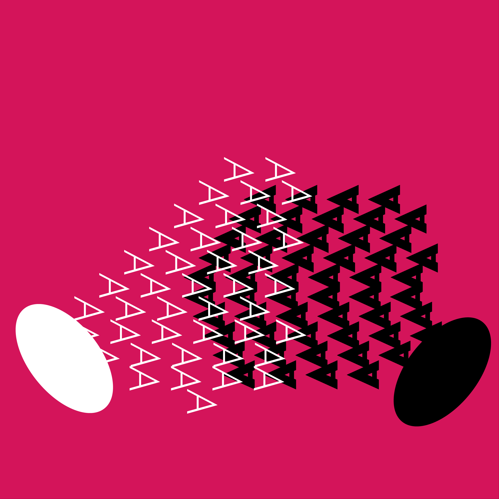

## Conference
The concept of a conference is about people, participants and organisers, interacting in the conference space or not, sharing information or not.
In an abstract arrangement of stage and audience, the concentric circles that make up the speaker have a dual role; on the one hand, they symbolize the speaker’s role as an information transmitter, as a transmission antenna (like the symbol of wifi if it were a whole circle). On the other hand, it is the target of all glances, which increases the tension and anxiety, if we look at it as a snapshot, it is like a pulsating, shaking target. The speech travels and touches some, if not all, of the participants. At the same time, it is like a ribbon of transmission of movement; the conference cannot function without the speakers, the participants and their interaction. Finally, the participants consist of two concentric circles. The external one, i.e. the inevitable interaction in a space where many people are gathered, someone sitting next to someone, a random nudge, a glance, an awkward dialogue. And the inner circle, the core of the person who can be exposed and interact, here it seems some people are touched by the talk and others are not.
The palette of colours is inspired by Mario de Meyer’s composition Going with the flow. The connection of the circles is inspired by the visual identity of Flow Csoport, designed by Villo Farkas, Seidl Mika and Brand Bar Communications. 

## Flow
The concept of flow refers to the flow of information and the enrichment of the knowledge of the participants of a successful conference and the flow of speech during the presentations. The goal was to use typography to create a texture that looks like a waterfall, but is discernible as consisting of words. The meaning of the words is not important because they are practically unreadable but the poem Hope by Joseph Addison has been chosen.

## Argument
Although in the context of a conference, the concept of disagreement could be treated as a constructive dialogue, in this composition, it is explored as disagreement for the sake of disagreement, a frequent phenomenon from the local café to scientific conferences. Black and white have been chosen as opposing extremes, while red creates more tension. The character A was chosen instead of words, coming from the continuous AAAAAAAAAAAA as a cry of anger and because of its shape as an arrow, as a triangle, all tension. The reason the same character was chosen by both sides is because many times both sides are actually saying the same thing or it doesn’t matter what they say as all that is heard is noise.