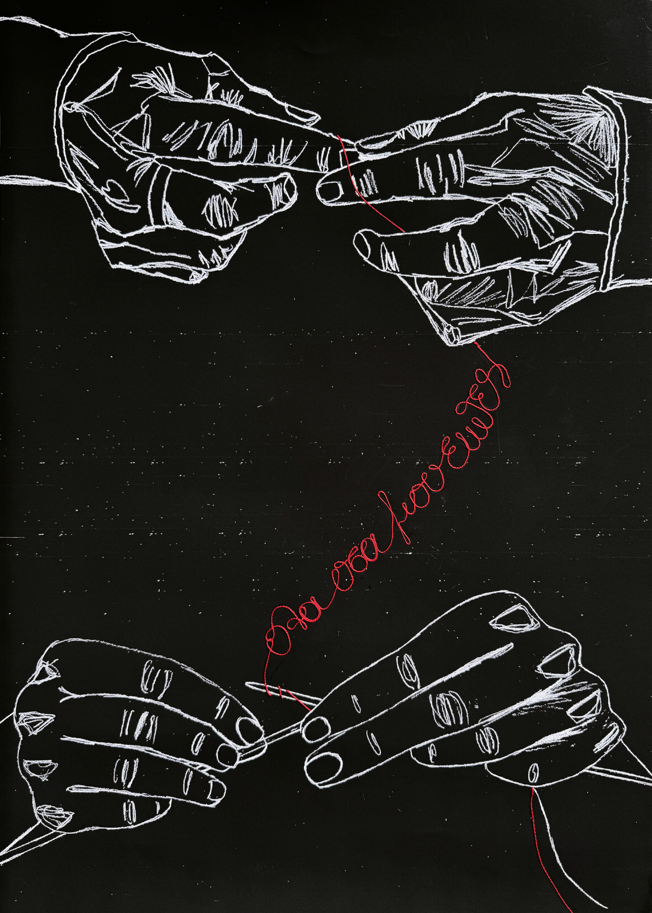

Mixed media poster, A2

I have been blessed with two grandmas and an adopted one, all sew, two knit and crochet and embroider, the third also used to weave.

I sew, crochet, knit although I do not particularly enjoy it, I have tried to embroider but I got a raincheck for the future and I weave. Apart from weaving, I have managed to teach myself everything else online, although both my grandmas are alive and kicking and were still crafting at the point. To be fair, one has tried to teach me how to crochet at a very young age with the thinnest thread and hook. Needless to say, it was a fail, too soon and my patience was certainly not developed. 

So even though, when I think of these crafts, I cannot say that I can re-call memories with my grandmas, somehow when I think of tradition, I think of threads and at the same time, when I think of threads, I think of words, phrases and other little pieces of wisdom that have transferred from them to me and shaped who I am. 

The two posters have been created for VAiF open call [Designing for Change: Memory / Tradition](https://vaif.gr/memory-tradition/) and submitted on June 15th 2026. To my knowledge up to this moment (August 14th 2026), whether they have been rejected or accepted is unknown to me.  

